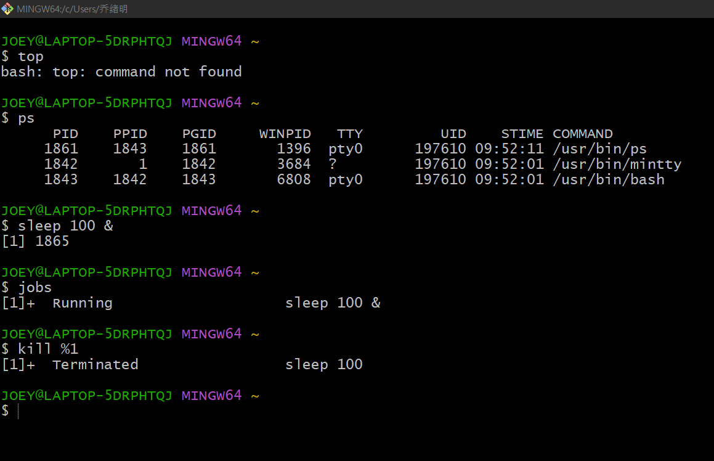

# Linux Process Commands

## 1. top

실행 중인 프로세스와 CPU, 메모리 사용량을 실시간으로 확인하는 명령어

```bash
top
```

## 2. ps

현재 실행 중인 프로세스를 확인하는 명령어

```bash
ps
```

## 3. jobs

현재 쉘에서 실행 중인 백그라운드 작업을 확인하는 명령어

```bash
jobs
```

## 4. kill

프로세스를 종료하는 명령어

```bash
kill PID
```

## 실습 결과

Windows Git Bash 환경에서 실습을 진행하였다.

- ps 명령어 실행
- jobs 명령어 실행
- kill 명령어 실행

top 명령어는 Git Bash 환경에서 지원되지 않아 실행되지 않았다.

